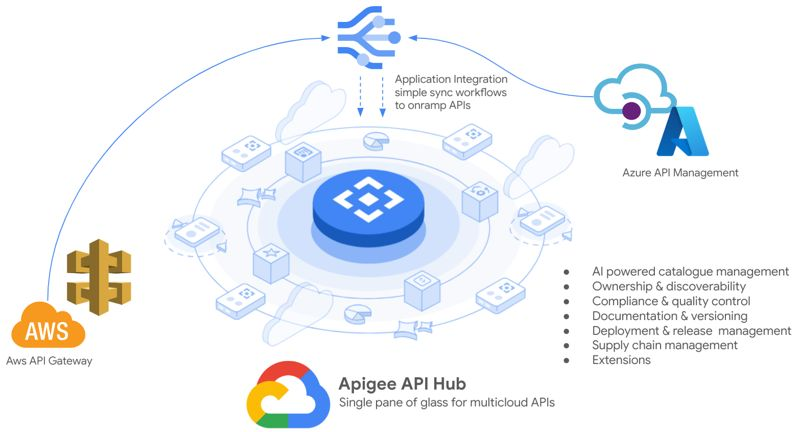

# Apigee API Hub Multicloud Onramp Sample
This is a sample project to demonstrate how to easily synchronize and onramp multicloud APIs from AWS and Azure to Apigee API Hub.

To use this sample, you will need to have a Google Cloud project with these services enabled:
- Apigee API Hub
- Application Integration
- Cloud Run

Flows that this sample demonstrates:
- Add an API to AWS API Gateway and have it automatically registered in API Hub.
- Add an API to Azure API Mnagement and have it automatically registered in API Hub.
- Add a new version of an API, and have the new version automatically added to the API in API Hub.
- Delete an API in AWS or Azure, and have the version automatically marked as deprecated in API Hub.

## Architecture overview


## Deployment instructions
After cloning this repository, follow these instructions to deploy into a Google Cloud project.

1. Open the **1.env.sh** file in an editor and set the variables to authorize requests for each cloud environment.
2. Run these commands to deploy the solution in a Google Cloud project.

```sh
# source the environment variables
source 1.env.sh

# create the resources in a Google Cloud project
./2.create.resources.sh
```
After deploying the resources, you can then open the Application Integration console to manage the integrations here: https://console.cloud.google.com/integrations.

